# Robotics_AB2_Part1

Importando as bibliotecas:

```
import math as m
import numpy as np
from roboticstoolbox DHRobot, RevoluteDH, PrismaticDH
import matplotlib.pyplot as plt
from spatialmath.base import *
```

## Questão 1:

### Letra A:
Sendo o espaço de trabalho do braço robô RR planar delimitado pelo comprimento dos elos L1 e L2, bem como pelas limitações de rotação das juntas, podemos visualizar a região da seguinte forma, considerando as restrições impostas:
```
def Space_Work(L1 = 1, L2 = 1):
    # Cria uma figura 3D
    fig = plt.figure()
    ax = fig.add_subplot(111, projection='3d')

    #  ngulos para o círculo em torno do eixo Z
    theta = np.linspace(0, np.pi, 100)
    theta2 = np.linspace(-np.pi/2, np.pi, 100)
    # Raio do círculo
    r = L1
    r2 = L1+L2

    # Coordenadas dos pontos no círculo
    x = r * np.cos(theta)
    y = r * np.sin(theta)
    z = np.zeros_like(theta)
    ax.plot(x, y, z, label='Junta 1')


    x1 = r2 * np.cos(theta2)
    y1 = r2 * np.sin(theta2)
    z1 = np.zeros_like(theta2)
    ax.plot(x1, y1, z1, label='Junta 2')

    # Adicione rótulos de eixo
    ax.axis('equal')
    ax.set_xlabel('Eixo X')
    ax.set_ylabel('Eixo Y')
    ax.set_zlabel('Eixo Z')

    ax.legend()
    plt.show()

    # Intervalo de valores de q1 e q2
    q1_values = np.linspace(0, np.pi, 100)
    q2_values = np.linspace(-np.pi/2, np.pi, 100)

    # Inicialize listas para armazenar as coordenadas x e y
    x_coords = []
    y_coords = []

    # Calcule as coordenadas cartesianas para cada par de valores de q1 e q2
    for q1 in q1_values:
        for q2 in q2_values:
            x = L1 * np.cos(q1) + L2 * np.cos(q1 + q2)
            y = L1 * np.sin(q1) + L2 * np.sin(q1 + q2)
            x_coords.append(x)
            y_coords.append(y)

    # Plote o espaço de trabalho
    plt.figure(figsize=(8, 6))
    plt.scatter(x_coords, y_coords, s=1, c='b', marker='.')
    plt.xlabel('Coordenada X')
    plt.ylabel('Coordenada Y')
    plt.title('Espaço de Trabalho do Manipulador RR Planar')
    plt.grid(True)
    plt.axis('equal')  # Manter proporções iguais nos eixos x e y
    plt.show()
```
Chamando a função:

```
Space_Work()
```
**Saída:**

<div style="display: flex;">
  <a name="figura1"></a>
  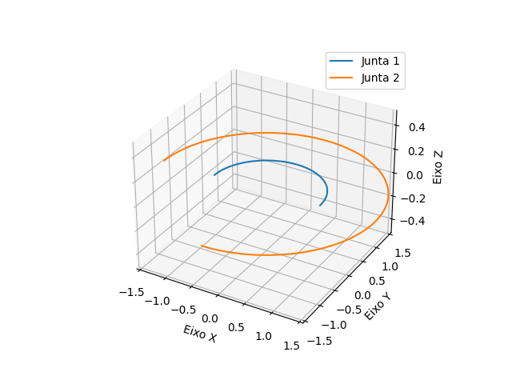
  <a name="figura2"></a>
  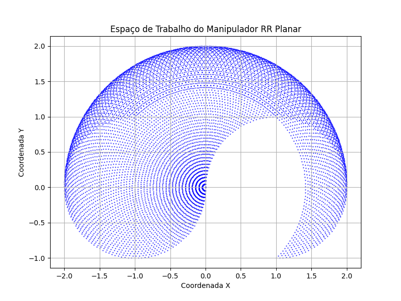
</div>

Podemos ver que, como o braço é planar, ele está restrito ao plano XY, onde na figura 1 vemos a restrições das juntas e na figura 2 podemos ver os pontos que podem ser alcançados definindo **L1 = L2 = 1**, e as com rotação de **$` 0 < \theta1 < \pi`$  e $` -\pi/2 < \theta2 < \pi`$**.

### Letra B:
Modelando o braço pela biblioteca Robotics ToolBox do Peter Corker:

```
def robot_RR(q = [0,0]):
    PLOT = True
    PI = np.pi

    e1 = RevoluteDH(d = 0, a  = 1 )
    e2 = RevoluteDH(a = 1 )

    rob = DHRobot([e1,e2], name = 'RR')
    #print(rob)
    rob.teach(q)
```

Sabendo que a tabela DH do braço RR planas é:

| j | θⱼ  |  dⱼ |   aⱼ   | ⍺ⱼ   |
| --|-----|-----|--------|------|
| 1 | q1  |  0  |   L1   | 0.0° |
| 2 | q2  |  0  |   L2   | 0.0° |

Podemos calcular a Pose final da base até o atuador pelas transformações:

$`^jT_{j+1}=\begin{bmatrix}\cos \theta _j&-\sin \theta _j\cos \alpha _j&\sin \theta _j\sin \alpha _j&a_j\cos \theta _j\\
\sin \theta _j&\cos \theta _j\cos \alpha _j&-\cos \theta _j\sin \alpha _j&a_j\sin \theta _j\\
0&\sin \alpha _j&\cos \alpha _j&d_j\\
0&0&0&1\end{bmatrix}`$

Onde a Pose final e dada por, no qual **$`S_{\theta1} = Sen(\theta1), C_{\theta1} = Cos(\theta1)`$** e assim por diante temos para braço acima:

$`^BT_W=^0T_2=^0T_1\cdot^1T_2=\begin{bmatrix}C_{\theta1}&-S_{\theta1}&0&L_1C_{\theta1}\\
S_{\theta1}&C_{\theta1}&0&L_1S_1\\
0&0&1&0\\
0&0&0&1\end{bmatrix}\begin{bmatrix}C_{\theta2}&-S_{\theta2}&0&L_2C_{\theta2}\\
S_{\theta2}&C_{\theta2}&0&L_2S_2\\
0&0&1&0\\
0&0&0&1\end{bmatrix}=\ \begin{bmatrix}C_{\theta1}C_{\theta2}&S_{\theta1}S_{\theta2}&0&L_1C_{\theta1}+L_2C_{\theta1}C_{\theta2}\\
S_{\theta1}S_{\theta2}&C_{\theta1}C_{\theta2}&0&L_1S_{\theta1}+L_2S_{\theta1}S_{\theta2}\\
0&0&1&0\\
0&0&0&1\end{bmatrix}`$

Para um Pose qualquer, dentro do espaço de trabalho:

$`^BT_W=\begin{bmatrix}C_{\phi}&-S_{\phi}&0&x\\
S_{\phi}&C_{\phi}&0&y\\
0&0&1&0\\
0&0&0&1\end{bmatrix}`$

Sendo x e y,  o ponto no plano XY que o atuador está localizado, igualando as poses obtemos as equações:

I. $`S_{\phi}=S_{\theta1}S_{\theta2}`$

II. $`C_{\phi}=C_{\theta1}C_{\theta2}`$

III. $`x=L_1C_{\theta1}+L_2C_{\theta1}C_{\theta2}`$

IV. $`y=L_1S_{\theta1}+L_2S_{\theta1}S_{\theta2}`$

Elevando ao quadrado III e IV e somando:

$`x^2+y^2=L_1^{\ \ 2}+L_2^{\ \ 2}+2L_1L_2C_{\theta 2}`$

Pela definição trigonometria:

$`C_{\theta 1}C_{\theta 2}=C_{\theta 1}C_{\theta 2}-S_{\theta 1}S_{\theta 2}`$

e

$`C_{\theta 1}C_{\theta 2}=C_{\theta 1}C_{\theta 2}-S_{\theta 1}S_{\theta 2}`$

$`C_{\theta} + S_{\theta} = 1`$

Podemos escrever:

$`C_{\theta 2}=\frac{x^2+y^2-L_1^{\ \ 2}-L_2^{\ \ 2}}{2L_1L_2}`$

$`S_{\theta 2}=\pm \sqrt{1-C_{\theta 2}^{\ \ \ \ 2}}`$

Isolando o ângulo:

$`\theta _2=A\tan 2(S_{\theta 2},C_{\theta 2})`$

Escrevendo x e y:

V. $`x=(k1)C_{\theta 1}-(k2)S_{\theta 1}`$

VI. $`y=(k1)S_{\theta 1}+(k1)C_{\theta 1}`$

Sendo:

$`k_1=(L_1+L_2C_{\theta 2})`$,

$`k_2=\ L_2S_{\theta 2}`$,

$`r=\sqrt{k_1^{\ \ 2}+k_2^{\ \ 2}}`$ e

$`\gamma =A\tan 2\left(k_1\ ,\ k_2\right)`$


Ajustando k1 e k2 em função de r e $`\gamma`$, obtemos:

$`k_1\ =\ r\cos \ \gamma `$

$`k_2\ =\ r\cos \ \gamma `$

Substituindo k1 e k2 nas equações V e VI:

$`\frac{x}{r}\ =\ C_{\gamma }C_{\theta 1}-\ S_{\gamma }S_{\theta 1}`$

$`\frac{y}{r}\ =\ C_{\gamma }S_{\theta 1}\ +\ S_{\gamma }C_{\theta 1}`$

Ajustando:

$`C\left(\gamma +\ \theta 1\right)\ =\ \frac{x}{r}`$

$`S\left(\gamma +\ \theta 1\right)\ =\ \frac{y}{r}`$

$`\gamma+\ \theta1\ =\ A\tan2\left(\frac{y}{r},\frac{x}{e}\right)=A\tan2\left(y,x\right)`$

Obtemos:

$`\begin{array}{l}\theta1\ =\ A\tan2\left(y,x\right)\ -\ A\tan2\left(k_1,k_2\right)\end{array}`$

Onde podemos achar $`\theta1`$ e $`\theta2`$ para a pose $`^BT_W`$.


Aplicando isto no código:

```
def inkine_RR(T= transl(0.5,1,0), L1=1, L2=1):
    R = [[T[0][0], T[0][1], T[0][2]], [T[1][0], T[1][1], T[1][2]], [T[2][0], T[2][1], T[2][2]]]
    P = [T[0][3], T[1][3], T[2][3]]

    x = P[0]
    y = P[1]

    print("Pose:\n", T)

    cO2 = (m.pow(x, 2) + m.pow(y, 2) - m.pow(L1, 2) - m.pow(L2, 2)) / (2 * L1 * L2)
   
    # Verificar se a condição é possível
    if abs(cO2) > 1:
        print("Configuração não é possível. Fora dos limites de alcance.")
        return
   
    sO2 = m.sqrt(1 - m.pow(cO2, 2))  # Raiz positiva
    O2 = m.atan2(sO2, cO2)

    k1 = (L1 + L2 * cO2)
    k2 = (L2 * sO2)
    gamma = m.atan2(k2, k1)
    r = m.sqrt(m.pow(k1, 2) + m.pow(k2, 2))

    k1 = r * m.cos(gamma)
    k2 = r * m.sin(gamma)

    O1 = m.atan2(y, x) - m.atan2(k2, k1)
   
    # Aplicar restrições para limitar O1 e O2 aos intervalos desejados
    O1_min = 0  # Limite inferior para O1
    O1_max = m.pi  # Limite superior para O1
    O2_min = -m.pi / 2  # Limite inferior para O2
    O2_max = m.pi  # Limite superior para O2
   
    print('Possíveis soluções:')
    # Verificar se os ângulos estão dentro dos limites
    if O1_min <= O1 <= O1_max and O2_min <= O2 <= O2_max:
        print("Solução 1:")
        print("O1:", O1, "O2:", O2)
        robot_RR([O1, O2])


    sO2 = -m.sqrt(1 - m.pow(cO2, 2))  # Raiz negativa
    O2 = m.atan2(sO2, cO2)

    k1 = (L1 + L2 * cO2)
    k2 = (L2 * sO2)
    gamma = m.atan2(k2, k1)
    r = m.sqrt(m.pow(k1, 2) + m.pow(k2, 2))

    k1 = r * m.cos(gamma)
    k2 = r * m.sin(gamma)

    O1 = m.atan2(y, x) - m.atan2(k2, k1)

    if O1_min <= O1 <= O1_max and O2_min <= O2 <= O2_max:
        print("Solução 1:")
        print("O1:", O1, "O2:", O2)
        robot_RR([O1, O2])
```
Para os casos, temos com entrada as Pose:

#### Caso 1:
```
inkine_RR()
```
**Saída:**
```
Pose:
 [[1.  0.  0.  0.5]
 [0.  1.  0.  1. ]
 [0.  0.  1.  0. ]
 [0.  0.  0.  1. ]]
Possíveis soluções:
Solução 1:
O1: 0.12955216714882267 O2: 1.9551931012905357
```
<p align="center">
  <a name="figura-5"></a>
  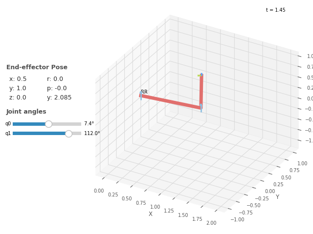
</p>

#### Caso 2:
```
T = transl(0,0.5,0)
inkine_RR(T)
```
**Saída:**
```
Pose:
 [[1.  0.  0.  0. ]
 [0.  1.  0.  0.5]
 [0.  0.  1.  0. ]
 [0.  0.  0.  1. ]]
Possíveis soluções:
Solução 1:
O1: 0.2526802551420786 O2: 2.636232143305636
```
<p align="center">
  <a name="figura-6"></a>
  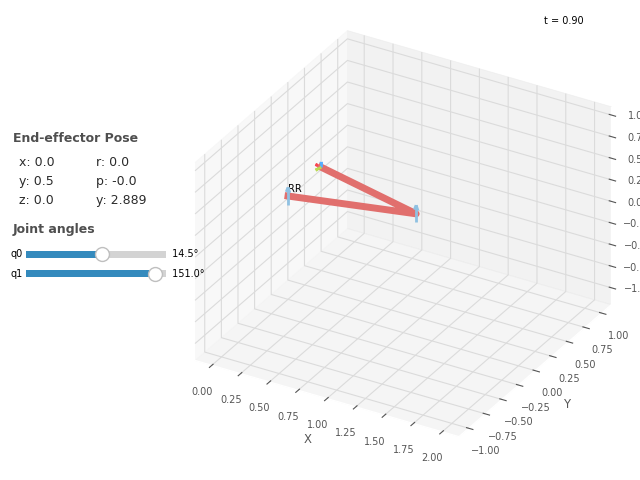
</p>

#### Caso 3:
```
T = transl(5,1,0)
inkine_RR(T)
```
**Saída:**

```
Pose:
 [[1. 0. 0. 5.]
 [0. 1. 0. 1.]
 [0. 0. 1. 0.]
 [0. 0. 0. 1.]]
Configuração não é possível. Fora dos limites de alcance.
```
Note que para alguns para caso 3 a pose não pode ser alcançada, já que o L1 + L2 não é capaz de alcança o ponto (5,1). Além disto, devido às limitações das juntas, pode existir de conjunto de ângulos possíveis.  
### Letra C:

Em um manipulador RR planar (que possui duas juntas rotativas), a orientação do efetuador final é determinada pelas posições das juntas q1 e q2 e pelas características físicas do manipulador, como os comprimentos dos elos. No entanto, diferentemente dos manipuladores robóticos com juntas rotativas e prismáticas, onde você pode especificar a orientação do efetuador como um ângulo ou uma matriz de rotação separadamente, em um manipulador RR planar, a orientação é intrinsecamente fixa já que ele está preso a plano XY.

### Letra D:
Quando calculamos a inversa, tende a aparece 2 conjuntos possíveis de pontos graças, já que $`\theta2`$ pode assumir valores negativos e positivo devido à raiz quadrada, mais em certos pontos chamados pontos singulares, só pode ser alcançados a parti de um conjunto de ângulos, isto pode acontecer quando $`\theta2`$ atinge os valores de -1 a 1, fazendo com que o braço perca um grau de liberdade, este ponto são comum nos extremos do espaço de trabalho, onde só podem ser alcançados quando $`\theta2 = \pm 90°k`$ e o braço está todo esticado L1 + L2.

Mais muita vezes devido às restrições das juntas, muitos pontos no espaço de trabalho só pode ser atingindo por 1 conjunto de ângulos, como visto no caso acima na Letra B, onde a outra solução acaba sendo impossível por conta da geometria do robô.

### Letra E:
Quando a pose e inalcançável, isto é os ponto x e y estão fora do espaço de trabalho ou os ângulos da $`\theta 1`$ e $`\theta 2`$ não estão dentro das condições impostas pelo braço, tem que não podemos achar uma solução através da cinemática inversa(inkine_RR), é deve ser sinalizado que aquela pose está fora de alcance.

## Questão 2:

### Letra A:

Podemos demostra o espaço de trabalho da pata robótica RR, a parti do código abaixo, onde os pontos x, y e z são calculados através da cinemática e da tabela DH:

$`^0T_3 = \begin{bmatrix}
cos(θ+90°)&-sin(θ + 90°)cos(90°)&sin(θ + 90°)sin(90°)&L*cos(θ+90°)\\
sin(θ+90°)&cos(θ+90°)cos(90°)&-cos(θ + 90°)sin(90°)&L*sin(θ+90°)\\
0&sin(90°)&cos(90°)&0\\
0&0&0&1
\end{bmatrix}
\begin{bmatrix}cos(α)&-sin(α)cos(0°)&sin(α)sin(0°)&R*cos(α)\\
sin(α)&cos(α)cos(0°)&-cos(α)sin(0°)&R*sin(α)\\
0&sin(0°)&cos(0°)&0\\
0&0&0&1
\end{bmatrix}
\begin{bmatrix}cos(β-90°)&-sin(β-90°)cos(0°)&sin(β-90°)sin(0°)&K*cos(β-90°)\\
sin(β-90°)&cos(β-90°)cos(0°)&-cos(β-90°)sin(0°)&K*sin(β-90°)\\
0&sin(0°)&cos(0°)&0\\0&0&0&1
\end{bmatrix}`$  
```
def Space_Work(L1 = 1,L2 = 1):
    # Cria uma figura 3D
    fig = plt.figure()
    ax = fig.add_subplot(111, projection='3d')

    #  ngulos para o círculo em torno do eixo Z
    theta = np.linspace(-np.pi/2, np.pi, 20)
    theta1 = np.linspace(-np.pi/2, np.pi, 20)
    theta2 = np.linspace(-np.pi/2, np.pi, 20)

    # Raio do círculos
    r = L1
    r1 = L1
    r2 = L1+L2

    # Coordenadas dos pontos no círculo
    x = r * np.cos(theta)
    y = r * np.sin(theta)
    z= np.zeros_like(theta)
    ax.plot(x, y, z, label='Junta 1')

    x1 = r1 * np.cos(theta1)
    y1 = np.zeros_like(theta1)
    z1 = r1 * np.sin(theta1)
    ax.plot(x1, y1, z1, label='Junta 2')

    # Coordenadas dos pontos no círculo
    x2 = r2 * np.cos(theta2)
    y2= r2 * np.sin(theta2)
    z2= np.zeros_like(theta2)
    ax.plot(x2, y2, z2, label='Junta 3')

    # Adicione rótulos de eixo
    ax.axis('equal')
    ax.set_xlabel('Eixo X')
    ax.set_ylabel('Eixo Y')
    ax.set_zlabel('Eixo Z')

    ax.legend()
    plt.show()

    # Inicialize listas para armazenar as coordenadas x, y e z
    x_coords = []
    y_coords = []
    z_coords = []

    # Calcule as coordenadas cartesianas tridimensionais para cada conjunto de valores de q1, q2 e q3
    for q1 in theta:
        for q2 in theta1:
            for q3 in theta2:
                x = -L2*m.sin(q3)*m.cos(q2)*m.sin(q1) - L2*m.cos(q3)*m.sin(q2)*m.sin(q1) - 0*m.sin(q1) - L1*m.cos(q3)*m.sin(q1)
                y = L2*m.sin(q3)*m.cos(q2)*m.cos(q1) + L2*m.cos(q3)*m.sin(q2)*m.cos(q1) + 0*m.cos(q1) + L1*m.cos(q3)*m.cos(q1)
                z = L2*m.sin(q3)*m.sin(q2) - L2*m.cos(q3)*m.cos(q2) + L1*m.sin(q3)
                x_coords.append(x)
                y_coords.append(y)
                z_coords.append(z)

    # Plote o espaço de trabalho tridimensional
    fig = plt.figure(figsize=(8, 6))
    ax = fig.add_subplot(111, projection='3d')
    ax.scatter(x_coords, y_coords, z_coords, s=1, c='b', marker='.')
    ax.set_xlabel('Coordenada X')
    ax.set_ylabel('Coordenada Y')
    ax.set_zlabel('Coordenada Z')
    ax.set_title('Espaço de Trabalho do Manipulador RRR')
    plt.show()
```
```
Space_Work()
```

**Saída:**

<div style="display: flex;">
  <a name="figura7"></a>
  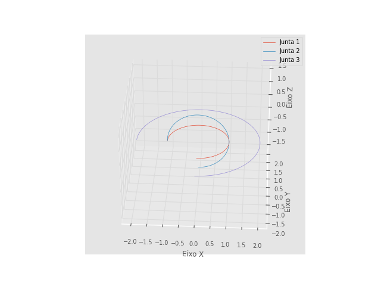
  <a name="figura8"></a>
  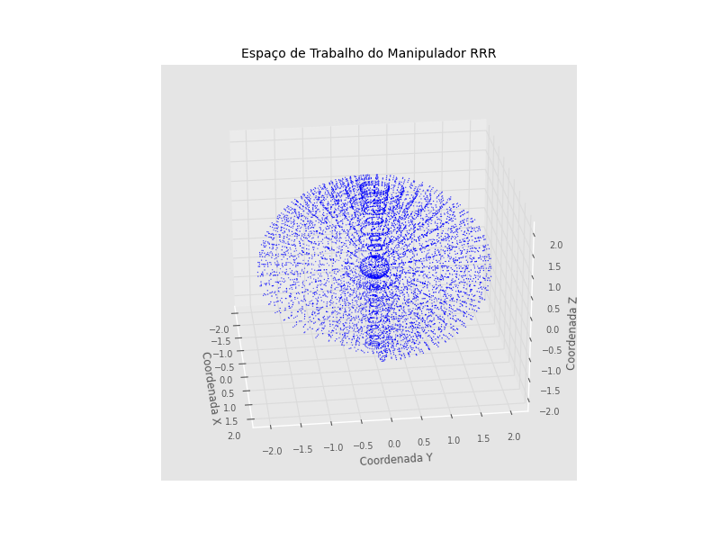
</div>

Note que ao olha com mais atenção, podemos ver que existe uma região dentro da esfera que não podemos alcançar devido às limitações das junta estarem entre [-pi/2, pi], isto pode ser melhor notado no círculo trigonométrico, onde a 4.º quadrante(indicado pela seta) possuir menos pontos, causado um afunilamento na região.  

<div style="display: flex;">
  <a name="figura9"></a>
  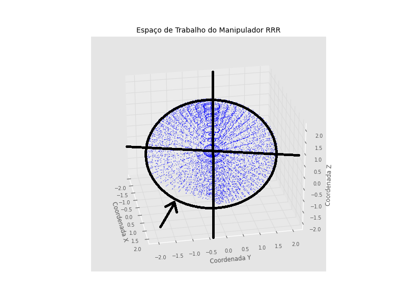
  <a name="figura10"></a>
  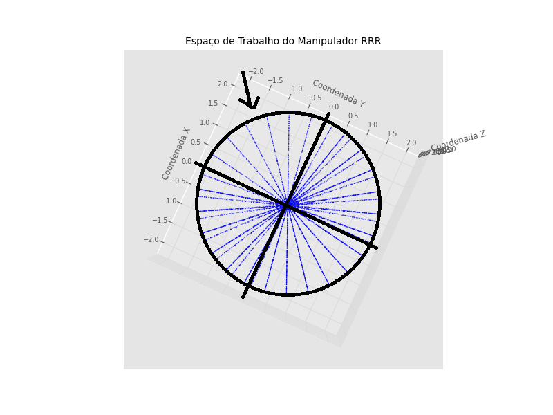
</div>

## Letra B:

Podendo descrever a pata robótica pela imagem:

<div style="display: flex;">
  <a name="figura9"></a>
  
  <a name="figura10"></a>
  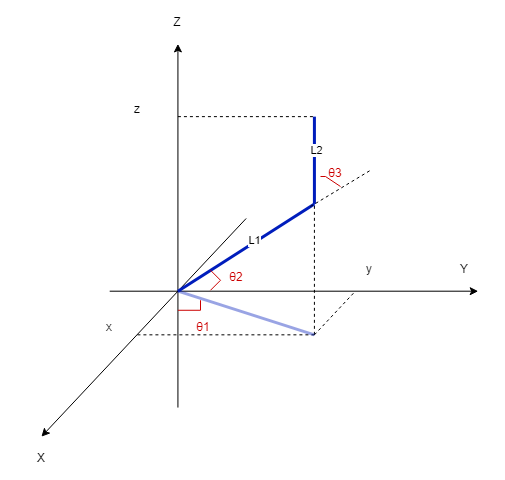
</div>

Olhando para plano ZY, podemos ver que a pata do robô se comporta com um RR planar,assim, pelo método geométrico podemos descobrir $`\theta1, \theta2`$ e $` \theta3`$ a inkine por:

Aplicando a Lei dos cossenos no triangulo superior:

<p align="center">
  <a name="figura-11"></a>
  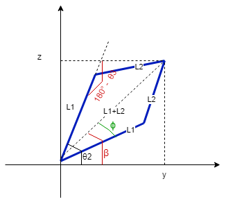
</p>


$` (\sqrt{z^2 +y^2})^2 = L1^2 + L2^2 - 2*L1*L2os(180° - \theta3) `$

Deixando em função de $`cos(\theta3)`$

$`cos(\theta3) = \frac{z^2 +y^2 - L1^2 - L2^2}{2*L1*L2}`$

Usando a função trigonométrica:

$`cos(\theta)^2 + sin(\theta)^2 = 1`$

Temos:

$`sin(\theta3) = \sqrt{1 - Cos(\theta3)^2}`$

$`\theta3 = Atan2(sin(\theta2), cos(\theta 2))`$

Já para achar $`\theta2`$, temos que:

$`\beta = Atan2(z,y)`$ e sendo pela lei dos cossenos

$`L2^2 = L1^2 + (\sqrt{z^2 +y^2})^2 - 2*L1*\sqrt{z^2 +y^2}cos(\phi)`$

$`cos(\phi) = \frac{z^2 +y^2 + L1^2 - L2^2}{2*L1*\sqrt{z^2 +y^2}}`$

Usando a função trigonométrica:

$`sin(\phi) = \sqrt{1 - Cos(\phi)^2}`$

$`\phi = Atan2(sin(\phi), cos(\phi))`$

Portanto:

$`\theta1 =\beta + \phi `$

É para achar $`\theta 1`$:

$`\theta1 = Atan2(y,x)`$

Modelando a pata por meio da Toolbox do Peter Corker:

```
def robot_RRR(q = [0,0,0],L1 = 0.15,L2 = 0.15):

    e1 = RevoluteDH(d = 0, alpha = PI/2, offset = PI/2)
    e2 = RevoluteDH(a = L1)
    e3 = RevoluteDH(a = L2,offset = -PI/2)

    rob = DHRobot([e1,e2,e3], name = 'RRR')
    #print(rob)
    rob.teach(q)
    return rob
```

Aplicando em codigo para achar $`\theta1, \theta2`$ e $` \theta3`$, temos:

```
def inkine_RRR(x, y, z, L1=0.15, L2=0.15):
    Co = (y**2 + z**2 - L1**2 - L2**2)/(2*L1*L2)

    if abs(Co) > 1:
        print("-1 < Cos theta > 1")
        return None

    So = m.sqrt(1 - Co**2) # Raiz Positiva
    o3 = m.atan2(So, Co)

    So1 = -m.sqrt(1 - Co**2) # Raiz Negativa 
    o31 = m.atan2(So1, Co)

    b = m.atan2(z, y)

    r = m.sqrt(y**2 + z**2)
    if r == 0:
        Cp = 0
    else:
        Cp = (y**2 + z**2 + L1**2 - L2**2)/(2*L1*r)

    if abs(Cp) > 1 :
        print("-1 < Cos phi > 1")
        return None

    Sp = m.sqrt(1 - Cp**2)
    p = m.atan2(Sp, Cp)


    if o3 > 0:
        o2 = b - p
        o21 = b + p
    else:
        o2 = b + p
        o21 = b - p

    o1 = m.atan2(y, x)

    print("Possivéis soluções:")
    if abs(o1 - PI/2) > m.pi/2 or abs(o2) > m.pi/2 or abs(o3+PI/2) > m.pi/2:
        
        print('θ1=',o1- PI/2,'θ2=',o2,'θ3=',o3+PI/2)
        q = [o1 - PI/2,o21,o31 + PI/2]
        robot_RRR(q = q)
        
        if abs(o1) > m.pi/2 or abs(o21) > m.pi/2 or abs(o31) > m.pi/2:
            print('θ1=',o1- PI/2,'θ2=',o21,'θ3=',o31+PI/2)
            q = [o1 - PI/2,o2,o3 + PI/2]
            robot_RRR(q = q)
    else:
        print("Não há solução dentro do intervalo -π/2 < θ1, θ2, θ3 < π/2")
        return None
```

## Letra C:

Ultiliza a inkine_RRR( ), desenvolvida no itém anterior podemos achar os ângulos atraves de x, y, e z disposto no espaço de trabalho e comparando com a inkine da biblioteca ToolBox

```
rob = robot_RRR()
```
<p align="center">
  <a name="figura-11"></a>
  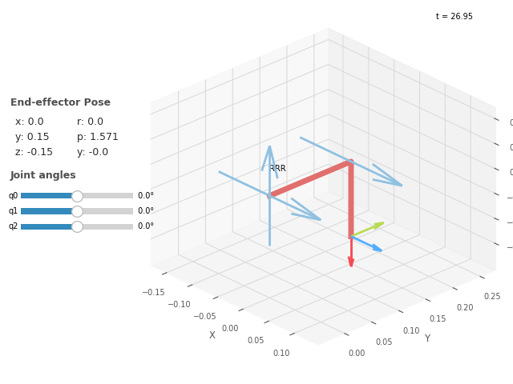
</p>

Posição zero das juntas.
### Caso 1:

```
inkine_RRR(x=0, y=1,z =0)


```
**Saída:**
```
Possíveis soluções:
θ1= 0.0 θ2= -1.994827366285637 θ3= 3.989654732571274
θ1= 0.0 θ2= 1.0471975511965976 θ3= -0.5235987755982991

Pose =
    0         0         1         0       
   0.5      -0.866     0         0.15    
   0.866     0.5       0         0       
   0         0         0         1       

Solução da Biblioteca:
 IKSolution: q=[0, -1.047, -2.618], success=True, iterations=5, searches=1, residual=7.41e-11
Pose =
    0         0         1         0       
   0.5       0.866     0         0.15    
  -0.866     0.5       0         0       
   0         0         0         1       

Solução da Biblioteca:
 IKSolution: q=[0, 1.047, -0.5236], success=True, iterations=15, searches=1, residual=2.97e-09
```
<div style="display: flex;">
  <a name="figura11"></a>
  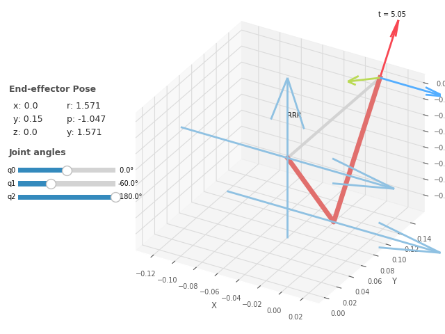
  <a name="figura12"></a>
  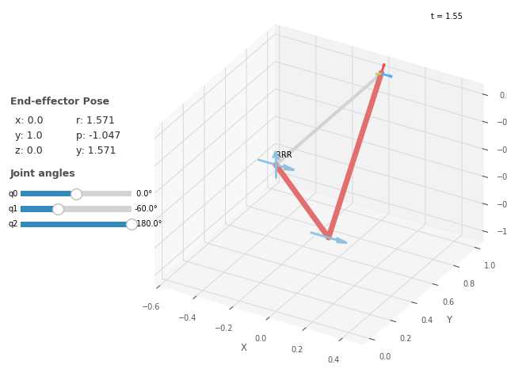
</div>

Através da do q encontrado, podemos conferir se nossa inkine está correta comparando com a inkine da toolbox, onde calculando a Pose através dos ângulos encontrados anteriomente, podemos a calcular a inversa com a função ikine_LM(Pose)
```
# Cinemática inversa
P = rob.fkine(q = [0.0,-1.0471975511965976,3.6651914291880923])
print('Pose =\n', P)
sol = rob.ikine_LM(P)
print('Solução da Biblioteca:\n',sol)

P = rob.fkine(q = [0.0,1.0471975511965976,-0.5235987755982991])
print('Pose =\n', P)
sol = rob.ikine_LM(P)
print('Solução da Biblioteca:\n',sol)
```
**Saída:**
```
Pose =
    0         0         1         0       
   0.5      -0.866     0         0.15    
   0.866     0.5       0         0       
   0         0         0         1       

Solução da Biblioteca:
 IKSolution: q=[0, -1.047, -2.618], success=True, iterations=5, searches=1, residual=7.41e-11
Pose =
    0         0         1         0       
   0.5       0.866     0         0.15    
  -0.866     0.5       0         0       
   0         0         0         1       

Solução da Biblioteca:
 IKSolution: q=[0, 1.047, -0.5236], success=True, iterations=15, searches=1, residual=2.97e-09
```
Note que obtermos os mesmo ângulo encontrados anteriomente, provando que nossa implementação, também note que para a função ikine_LM, é necessário enviar uma pose, não só as coordenada de x,y,z, pois nesta função ele também computar a orientação final, influenciando nos ângulos resualtante, no caso que só foi passado uma Pose qualquer sem rotação através da P = transl(x,y,z), obteve um grande erro na pose final, já que ele tente orienta a o atuador para que os ângulos sejam correspondentes a da pose inicial, no caso $`cos(\phi) = 0`$ 
### Caso 2:

```
inkine_RRR(x=0,y=0.07,z=-0.07)
print(rob.ikine_LM(transl(x=0,y=0.5,z=-0.5)))
rob = robot_RRR(q=[-1.368, -2.779, 4.182])
```
**Saída:**
```
Possivéis soluções:
θ1= 0.0 θ2= -2.0199087495022043 θ3= 4.039817499004409
θ1= 0.0 θ2= 0.4491124227073078 θ3= -0.8982248454146156
```
<div style="display: flex;">
  <a name="figura11"></a>
  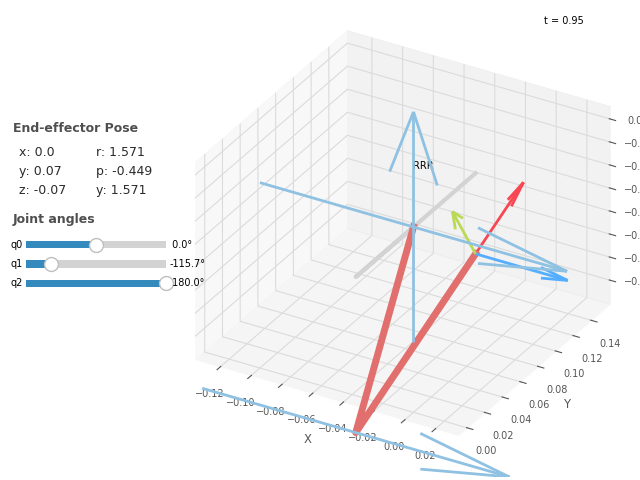
  <a name="figura12"></a>
  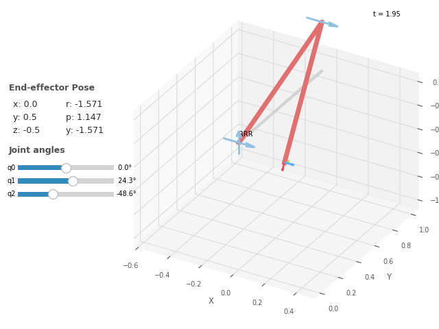
</div>

Dá mesma forma que no caso 1:
```
# Cinemática inversa
P = rob.fkine(q = [0.0,-2.0199087495022043,4.039817499004409])
print('Pose =\n', P)
sol = rob.ikine_LM(P)
print('Solução da Biblioteca:\n',sol)

P = rob.fkine(q = [0.0,0.4491124227073078,-0.8982248454146156])
print('Pose =\n', P)
sol = rob.ikine_LM(P)
print('Solução da Biblioteca:\n',sol)
```
**Saída:**
```
Pose =
    0         0         1         0       
   0.9008   -0.4342    0         0.07    
   0.4342    0.9008    0        -0.07    
   0         0         0         1       

Solução da Biblioteca:
 IKSolution: q=[0, -2.02, -2.243], success=True, iterations=6, searches=1, residual=1.01e-08
Pose =
    0         0         1         0       
  -0.4342    0.9008    0         0.07    
  -0.9008   -0.4342    0        -0.07    
   0         0         0         1       

Solução da Biblioteca:
 IKSolution: q=[0, 0.4491, -0.8982], success=True, iterations=7, searches=1, residual=2.22e-07
```

# Questão 3:
Semelhante a que questão anterior, podemos desenvolver a inkine do Scara de forma trigonométrica ilustrado abaixo:

<p align="center">
  <a name="figura-11"></a>
  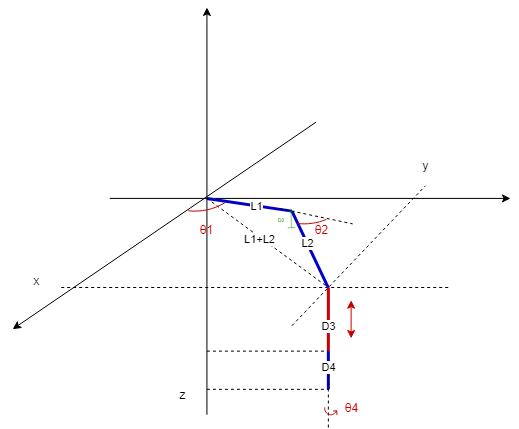
</p>

Dividindo o problema em duas partes, sendo $`\theta1`$ e $`\theta2`$ um braço planar RR, temos pela lei dos cossenos que:

$` (\sqrt{x^2 +y^2})^2 = L1^2 + L2^2 - 2*L1*L2os(180° - \theta2) `$

<p align="center">
  <a name="figura-11"></a>
  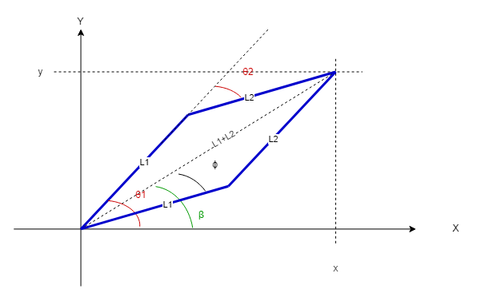
</p>

Deixando em função de $`cos(\theta3)`$

$`cos(\theta2) = \frac{x^2 +y^2 - L1^2 - L2^2}{2*L1*L2}`$

Usando a função trigonométrica:

$`cos(\theta)^2 + sin(\theta)^2 = 1`$

Temos:

$`sin(\theta2) = \sqrt{1 - Cos(\theta2)^2}`$

$`\theta2 = Atan2(sin(\theta2), cos(\theta 2))`$

Já para achar $`\theta2`$, temos que:

$`\beta = Atan2(x,y)`$ usando novamente a lei dos cossenos podemos achar $`\phi`$:

$`L2^2 = L1^2 + (\sqrt{x^2 +y^2})^2 - 2*L1*\sqrt{x^2 +y^2}cos(\phi)`$

Deixando em função de $`\phi`$:

$`cos(\phi) = \frac{x^2 +y^2 + L1^2 - L2^2}{2*L1*\sqrt{x^2 +y^2}}`$

Usando a função trigonométrica:

$`sin(\phi) = \sqrt{1 - Cos(\phi)^2}`$

$`\phi = Atan2(sin(\phi), cos(\phi))`$

Já para achar D3, temos que:

<p align="center">
  <a name="figura-11"></a>
  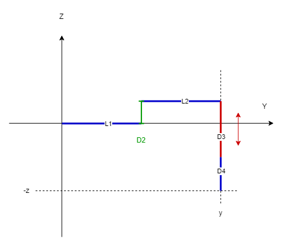
</p>

$`-z = - D2 + D3 + D4 `$

Então, $`D3 = -z - D4 + D2`$

É por último, como $`\theta4`$ só influencia na rotação do atuador, temos que:

$`\theta4 = 0°`$

Aplicando no código:

```
def inkine_Scara(x, y, z, L1=1, L2=1, D2 =0.2 , D4 = 0.2):
    Co = (y**2 + x**2 - L1**2 - L2**2)/(2*L1*L2)

    if abs(Co) > 1:
        print("-1 < Cos theta > 1")
        return None

    So = m.sqrt(1 - Co**2) # Raiz Positiva
    o2 = m.atan2(So, Co)

    So = -m.sqrt(1 - Co**2) # Raiz Negativa
    o21 = m.atan2(So, Co)

    b = m.atan2(y, x)
    r = m.sqrt(y**2 + x**2)
   
    if r == 0:
        Cp = 0
    else:
        Cp = (y**2 + x**2 + L1**2 - L2**2)/(2*L1*r)

    if abs(Cp) > 1 :
        print("-1 < Cos phi > 1")
        return None

    Sp = m.sqrt(1 - Cp**2)
    p = m.atan2(Sp, Cp)

    if o2 > 0:
        o1 = b - p
        o11 = b + p
    else:
        o1 = b + p
        o11 = b - p

    d3 = -z - D4 + D2
   
    o4 = 0

    print("Possíveis soluções:")

    print('θ1=',o1,'θ2=',o2,'D3=',d3,'θ4=',o4)
    q = [o1,o2,d3,o4]
    robot_Scara(q = q)

    print('θ1=',o11,'θ2=',o21,'D3=',d3,'θ4=',o4)
    q = [o11,o21,d3,o4]
    robot_Scara(q = q)
```

Modelando o robô  atraves da ToolBox:

```
def robot_Scara(q = [0,0,0.5,0],L1=1,L2=1,D1=0.2,D3=[0,1],D4=0.2):

    e1 = RevoluteDH(a = L1,d = D1)
    e2 = RevoluteDH(a = L2,alpha = PI)
    e3 = PrismaticDH(qlim = D3)
    e4 =  RevoluteDH(d = D4)
    rob = DHRobot([e1,e2,e3,e4], name = 'RRPR')
   
    rob.teach(q)
```
#### Caso 1:

```
inkine_Scara(x = 1,y = 1, z = -1)
```
**Saída:**
```
Possíveis soluções:
θ1= -1.1102230246251565e-16 θ2= 1.5707963267948966 D3= 1.0 θ4= 0

θ1= 1.5707963267948966 θ2= -1.5707963267948966 D3= 1.0 θ4= 0
```

<div style="display: flex;">
  <a name="figura11"></a>
  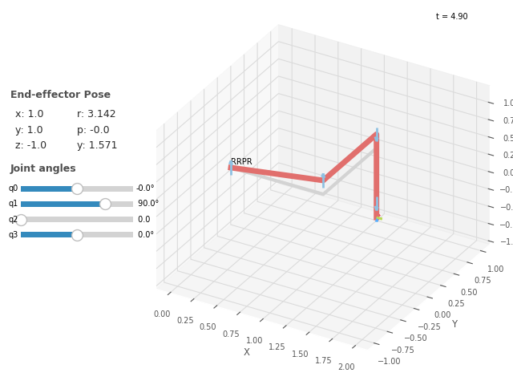
  <a name="figura12"></a>
  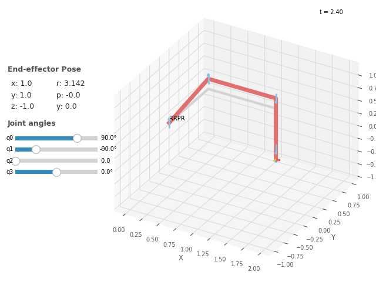
</div>

#### Caso 2:

```
inkine_Scara(x = 0,y = 0.5, z = -1)
```
**Saída:**
```
Possivéis soluções:
θ1= 0.2526802551420786 θ2= 2.636232143305636 D3= 1.0 θ4= 0

θ1= 2.8889123984477143 θ2= -2.636232143305636 D3= 1.0 θ4= 0

```

<div style="display: flex;">
  <a name="figura11"></a>
  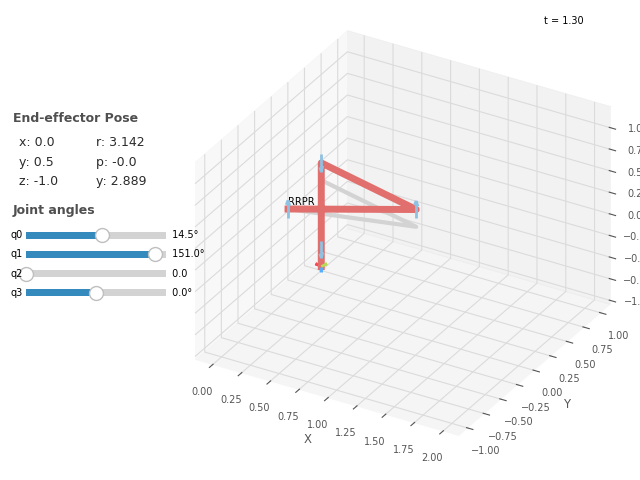
  <a name="figura12"></a>
  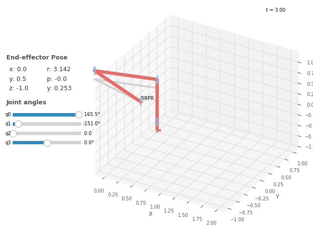
</div>

#### Caso 3:

```
inkine_Scara(x = 0.5,y = 0, z = -0.5)
```
**Saída:**
```
Possivéis soluções:
θ1= -1.318116071652818 θ2= 2.636232143305636 D3= 0.5 θ4= 0

θ1= 1.318116071652818 θ2= -2.636232143305636 D3= 0.5 θ4= 0

```

<div style="display: flex;">
  <a name="figura11"></a>
  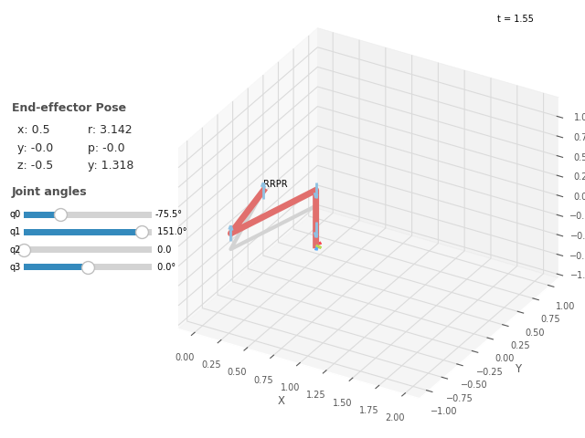
  <a name="figura12"></a>
  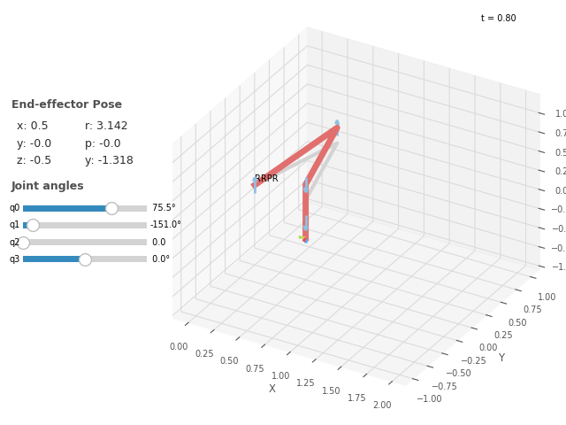
</div>

Vemos que para todos os casos acimas, existem duas possíveis soluções, no caso "cotovelo para baixo" e "cotovelo para cima", como as juntas não estão delimitadas, só existe a condição de o ponto exista dentro do espaço de trabalho, para ser possível representar a pose final.

